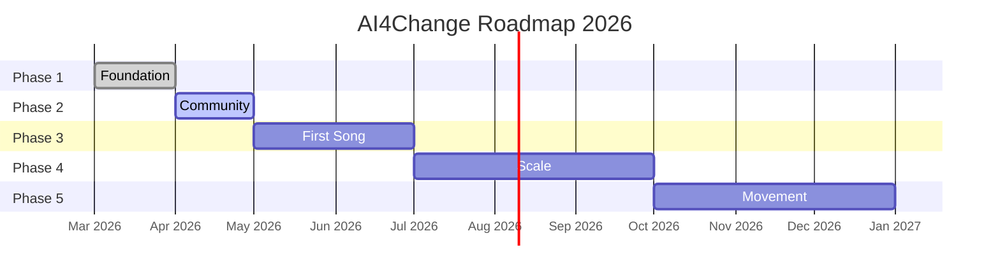
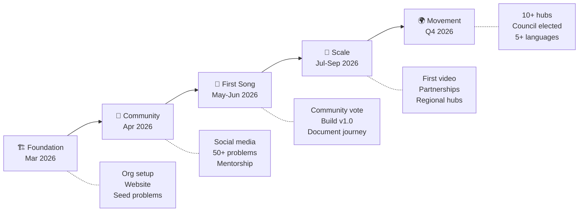

# AI4Change Roadmap

### From foundation to movement

 

---

## Overview

This roadmap outlines the journey from establishing AI4Change to building a global movement of people using AI to solve real-world problems. Each phase builds on the last. Each milestone brings us closer to our first "song."

---

## Timeline

---

## Phase 1: Foundation

**Timeline**: March 2026
**Status**: In Progress

> *Set the stage. Build the instruments. Tune up.*

### Goals

- Establish the organizational presence and brand identity
- Launch the website as a public-facing hub
- Begin collecting seed problems from communities worldwide
- Create the documentation and governance framework

### Milestones

- [x] Create GitHub organization (`ai4change-org`)
- [x] Set up org profile with README, manifesto, brand guidelines
- [x] Create `problems` repo with issue templates
- [x] Launch website at [ai4change-org.github.io](https://ai4change-org.github.io)
- [x] Publish SECURITY.md, SUPPORT.md, GOVERNANCE.md, FUNDING.yml
- [ ] Collect first 10 seed problems from diverse communities
- [ ] Set up GitHub Discussions for community conversation
- [ ] Define contribution guidelines (CONTRIBUTING.md)

### Success Metrics

| Metric | Target |
|:-------|:-------|
| Seed problems submitted | 10+ |
| Countries represented in problems | 5+ |
| GitHub stars (across org) | 50+ |
| Org profile README engagement | Measurable via traffic analytics |

### Key Deliverables

- Organization profile and branding
- Website (static, GitHub Pages)
- Problem submission pipeline
- Governance and community documentation

---

## Phase 2: Community

**Timeline**: April 2026
**Status**: Planned

> *Find the musicians. Start jamming. See what resonates.*

### Goals

- Grow the community to critical mass
- Reach 50+ problems submitted from 10+ countries
- Launch social media presence to amplify the mission
- Begin identifying candidates for the first "song"

### Milestones

- [ ] Social media launch (Twitter/X, LinkedIn, Reddit)
- [ ] 50+ problems submitted and categorized
- [ ] Community voting/signaling system for problem prioritization
- [ ] First community-driven problem aggregation report
- [ ] 25+ contributors engaged in discussions
- [ ] Announce the concept of "songs" (pilot projects)
- [ ] Identify 3-5 candidate problems for the first pilot
- [ ] Launch mentorship program (pairing experienced contributors with newcomers)

### Success Metrics

| Metric | Target |
|:-------|:-------|
| Problems submitted | 50+ |
| Countries represented | 10+ |
| Active discussion participants | 25+ |
| Social media followers (combined) | 500+ |
| Candidate problems for first song | 3-5 |

### Key Deliverables

- Problem trending board
- Community signaling mechanism
- Social media presence and content pipeline
- Mentorship program launch

---

## Phase 3: First Song

**Timeline**: May - June 2026
**Status**: Planned

> *Pick the song. Gather the band. Hit record.*

### Goals

- Community selects and builds the first "song" — a pilot project
- Demonstrate the AI4Change model end-to-end
- Document the entire journey for storytelling
- Prove that strangers from different continents can build together

### Milestones

- [ ] Community votes on the first pilot problem
- [ ] Form the first project team (diverse, global contributors)
- [ ] Kick off development with clear project charter
- [ ] Contributors use AI tools as multipliers (documented workflow)
- [ ] Midpoint demo and community check-in
- [ ] Ship v1.0 of the first solution — open source, documented
- [ ] Begin filming/documenting the "making of" story
- [ ] Retrospective: what worked, what didn't, what we learned

### Success Metrics

| Metric | Target |
|:-------|:-------|
| Contributors on first song | 10+ from 5+ countries |
| Time from vote to v1.0 | 6-8 weeks |
| AI tools used by contributors | Documented per contributor |
| Open source artifacts | Code, data, docs, story |
| Community engagement during build | Weekly updates, public demos |

### Key Deliverables

- First pilot project (v1.0) — open source
- "Making of" documentation and raw content
- Contribution playbook based on lessons learned
- Retrospective report

---

## Phase 4: Scale

**Timeline**: July - September 2026
**Status**: Planned

> *Release the first song to the world. Start recording the next ones.*

### Goals

- Tell the story of the first "song" to the world
- Produce the first "Song Around the World" video/content
- Launch multiple concurrent projects
- Build partnerships with aligned organizations

### Milestones

- [ ] Publish the first "Song Around the World" — video/content about the pilot
- [ ] Launch 2-3 additional community-selected projects
- [ ] Establish partnerships (NGOs, universities, open-source foundations)
- [ ] Contributor recognition program
- [ ] Explore sustainability model (grants, sponsorships, donations)
- [ ] Regional hub pilot — first 2-3 regional communities
- [ ] Streamline the problem-to-solution pipeline based on learnings

### Success Metrics

| Metric | Target |
|:-------|:-------|
| Active "songs" (projects) | 3-4 |
| Total contributors | 50+ |
| Countries represented | 15+ |
| Partnerships established | 3+ |
| Video/content views | 10,000+ |
| Regional hubs started | 2-3 |

### Key Deliverables

- "Song Around the World" video/content
- Multiple active projects with diverse contributor teams
- Partnership framework and first agreements
- Sustainability plan draft

---

## Phase 5: Movement

**Timeline**: Q4 2026 (October - December)
**Status**: Planned

> *From project to movement. From org to ecosystem.*

### Goals

- Transition from a project to a self-sustaining movement
- Establish regional hubs worldwide
- Build partnerships with NGOs, educational institutions, and governments
- Create pathways for the next generation of AI problem-solvers

### Milestones

- [ ] 10+ regional hubs across 4+ continents
- [ ] Partnerships with educational institutions (AI4Change in curricula)
- [ ] NGO partnerships for problem sourcing and solution deployment
- [ ] Community Council elected (see [Governance](../GOVERNANCE.md))
- [ ] Localized content in 5+ languages
- [ ] Annual "State of AI4Change" report
- [ ] Second "Song Around the World" video featuring multiple completed projects
- [ ] Sustainability model operational (grants, sponsorships, or donations funding operations)

### Success Metrics

| Metric | Target |
|:-------|:-------|
| Regional hubs | 10+ |
| Languages with localized content | 5+ |
| Active contributors | 200+ |
| Completed "songs" | 5+ |
| Educational partnerships | 3+ |
| NGO partnerships | 5+ |
| Deployed solutions in active use | 2+ |

### Key Deliverables

- Self-governing community with elected council
- Regional hub network
- Educational partnerships and curriculum integration
- Multiple completed and deployed solutions
- Sustainability model

---

## Journey Map

---

## How You Can Help — Right Now

| Your Skill | How to Contribute |
|:-----------|:-----------------|
| **You have a problem** | [Submit it](https://github.com/ai4change-org/problems/issues/new) — this is the most important thing |
| **You build things** | Watch for the first pilot project announcement |
| **You tell stories** | Help us document the journey and spread the word |
| **You design** | Help improve the website, brand, and visual identity |
| **You connect people** | Share AI4Change with communities who need it |
| **You speak multiple languages** | Help translate content for your community |

---

 

*This roadmap is a living document. It evolves with the community.*
*Suggest changes in [Discussions](https://github.com/orgs/ai4change-org/discussions).*

 

**Every solution starts with a problem. Every journey starts with a step.**

 

